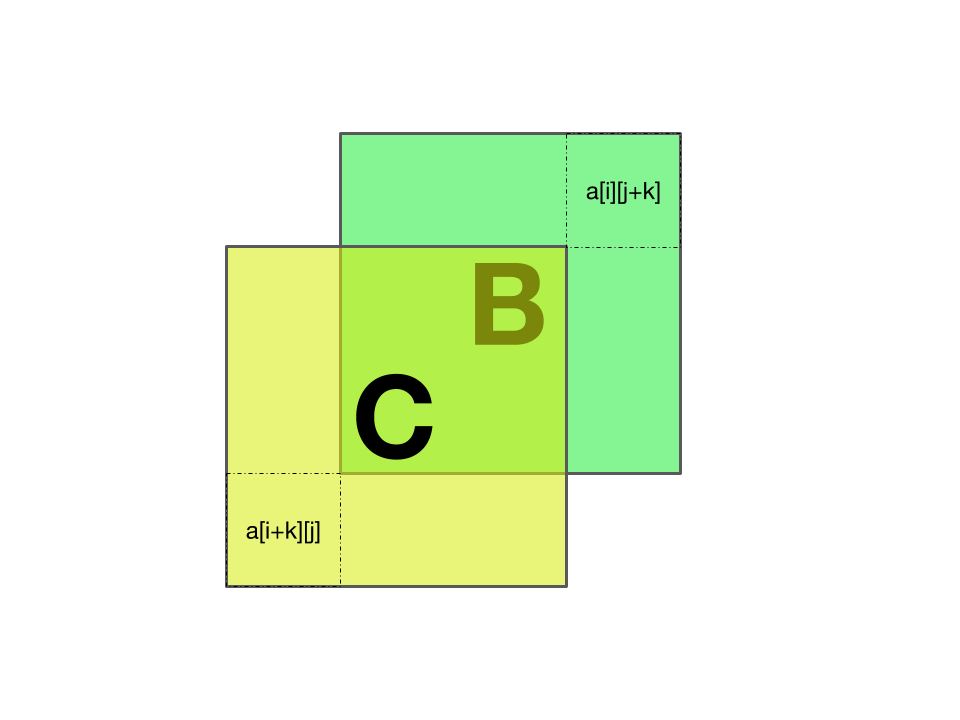

# Competitive Programmer's Core Skills 

These are my solutions for the course [Competitive Programmer's Core Skills](https://www.coursera.org/learn/competitive-programming-core-skills/), available on Coursera for 59 USD. The problems can be found [in this very repo](./problem_statements.pdf).

## Week 1 (3/4 complete)

### 1.1 Addition and Subtraction

This problem admits an O(1) solution, but I'm stuck. Lots of corner cases; my solution fails on some test cases.

### 1.2 Erasing Maximum

Trivial, runs in O(n) time. 

Run through the array once to get the maximum element. Then run through the
array again and delete either the only maximum element or the third.

### 1.3 Increment

Trivial O(n) solution. We note that unless the number is made of all 9s, incrementing it will not change the number of decimal digits.

### 1.4 Straight Flush

No tricks here, the only hiccup is the Ace. The check for the Ace is not so straightforward. I initialised the Ace as 14 (but it also can act as a 1). So the following code is needed to "convert" the Ace over.

```cpp
int cards[5] = ....;
if (cards[0] == 2 && cards[4] == 14) 
{
    // We have a straight here...
    cards[4] = 1;
    sort(cards);
}
```

Runs in constant time, obviously.

## Week 2 (2/4 complete)

### 2.1 The Cheapest Permutation
My solution runs in 2^n time, which is bad, but `n <= 9`, so this is fine.

I can't find a polynomial time algorithm for this, just used brute force.

For every possible permutation (there are `n!` of them), add them up and get the minimum cost one.

### 2.2 The King

Not sure how to do this one. 

### 2.3 Sum of Minimums

O(n^2) solution, once again by enumerating all the possibilities and memoizing. I hesitate to call this a "dynamic programming" algorithm, because the recurrence relation is trivial.

Initialise a 2-dimensional `n * n` array.
For each value in the input, `a[i][i] = val`.

This gives us the "edge of the pyramid". Then we just fill up the rest according to the recurrence relation.

The recurrence relation is as follows: for an interval `[l, r]`,
`min[l,r] = min( [l+1, r], [l, r-1] )`

Finally, just sum up the whole pyramid.

### 2.4 Expression Evaluation

An obvious and rather trivial O(n) solution presents itself.

## Week 3 (2/4 complete)

### 3.1 Compare Sums

The trick is to realise that the floating point numbers have *exactly 3 digits after the decimal point*. That means that multiplying each floating point number by 1000 gives an integer. Doing this requires some string processing; I used `tmp.substr()` and `tmp.find('.')` to grab the integer bit and the decimal bit.

```cpp
int integer_portion = std::stoi(tmp.substr(0, tmp.find(delimiter))) * 1000;
int decimal_portion = std::stoi(tmp.substr(tmp.find(delimiter) + 1, tmp.size()));
```

and once everything becomes an integer, checking if they're equal is trivial.

### 3.2 Round Up

### 3.3 Yet Another Sum

The problem here is to keep the error small.

I separate the sum and the reciprocal sum. The sum is all integers so there
will be no errors there. Then summing the reciprocal keeps the errors small as the numbers are all <1.

Small gotcha: to do the reciprocal, we can't do `1/n` as this will perform integer division. Instead do `1.0/n` to cast to double.

### 3.4 Binary Knapsack

We know that an exact algorithm for Knapsack is NP-complete (polynomial in the weight `W` of the knapsack). Given that our weight is 10^9, this is rather bad; we need to make use of the binary property of the weights.

Recall that a greedy approach taking the best ratio is not optimal. Consider the following knapsack instance:

```
3 4
1 3
2 2
4 6
```
Here the greedy approach taking `1` breaks down as taking `4` is the best.

What's important about the binary property of the weights?

For a good with value `v` and weight `w`, we know right away that 

## Week 4 (2/4 complete)
### 4.1 Most Frequent Letter

"To compute a range sum, take the difference of two prefix sums" --- Kuan 2018

Initialise an array of letter arrays, where each letter-array keeps track of the number of occurrences of each letter at that point.

So consider the string s = `abcda`, the letter arrays would be as follows:

```
las[0] = [1, 0, 0, 0, .... ,0] // 1 a, 0 of other letters
las[1] = [1, 1, 0, 0, .... ,0] // add 1 b
las[2] = [1, 1, 1, 0, .... ,0] 
las[3] = [1, 1, 1, 0, .... ,0]
las[4] = [2, 1, 1, 0, .... ,0]  
```

and the formula to calculate the most frequent letter in a subset `l,r` is simply `las[r] - las[l-1]` or just `las[r]` when l = 0, which runs in `O(1)` time.

Overall runtime is `O(n)`.

### 4.3 Multiset

The problem is very straightforward. You have a 100,000 element array and you want to find the number of occurrences of each number. 

The code is so easy I'm just going to put it here:

```cpp
void print_out(array<int, 100001> &xs)
{
    for (int i = 1; i < 100001; i++)
    {
        if (xs[i] == 0)
            continue;
        else
            cout << i << " " << xs[i] << '\n';
    }
}

int main()
{
    std::ios_base::sync_with_stdio(false);
    cin.tie(0);
    int n;
    array<int, 100001> S = {0};

    cin >> n;
    int l;
    int r;

    while (cin >> l >> r)
    {
        for (int i = l; i <= r; i++)
        {
            S[i]++;
        }
    }

    print_out(S);

    return 0;
}
```

This is a bit of a curious one. Originally I got TLE but after `std::ios_base::sync_with_stdio(false)`,
`cin.tie(0)`, and `cout >> '\n'` rather than `cout >> endl` which flushes the buffer, I was able to make this `O(n^2)` solution pass.

I'm curious if there's a solution that runs in `O(n log n)` time.
**EDIT 7th September 2018**
There is an `O(n log n)` solution using segment trees. I'll probably want to write it up and put it on the blog, it's quite interesting.

### 4.4 Maximal Sum Subarray

## Week 5 (3/4 complete)
### 5.1 Longest Increasing Sequence (solved 7th September 2018)
### 5.2 Minimum Edit Distance (solved 10th September 2018)
### 5.3 Digit Sum (solved 10th September 2018)
### 5.4 Make it Sorted

## Week 6 (4/4 complete)
### 6.1 Knapsack (solved 9th September 2018)
Bog standard implementation of the 0-1 knapsack problem.
As a nice bonus, solving this problem meant I could solve the (identical) knapsack
problem on Tim Roughgarden's Algos course.
### 6.2 Chain Matrix Multiplication (solved 8th September 2018)

### 6.3 Longest Common Subsequence (solved 10th September 2018)
 Given two sequences A and B of the same length, find the largest common subsequence; 
 that is, find the largest integer k such that there exist two sequences of indices
 ```
 i_0, i_1 , ..., i_n and
 j_0, j_1, ...., j_n 
 ```
 of length k such that for all `0 <= x <= n, A[i_x] = B[j_x]`.

For example, one largest common subsequence of the two sequences
```
1 2 3 4 5
1 3 2 4 4
```
is
```
0 1 3
0 2 3
```

This admits a dynamic programming solution that runs in O(n^2) time.

### 6.4 Maximum Sum Square (solved 11th September 2018)
Given an nxn matrix A of integers an an integer k,
find a kxk submatrix of A with the maximum sum of elements.

1 <= k <= n <= 700
Integers in the matrix are guaranteed to be <= 1000.

That means 700 * 700 * 1000 <= INT_MAX, so we can use integers.
The dynamic programming algorithm relies upon a nice geometrical relation.


Suppose we want to find the sum of the submatrix D. We can do a constant amount of work to find it by relying on the previous computations.





With this memoization, the solution runs in O(n^2) time rather than the O(n^2k^2) time needed in a naive solution.